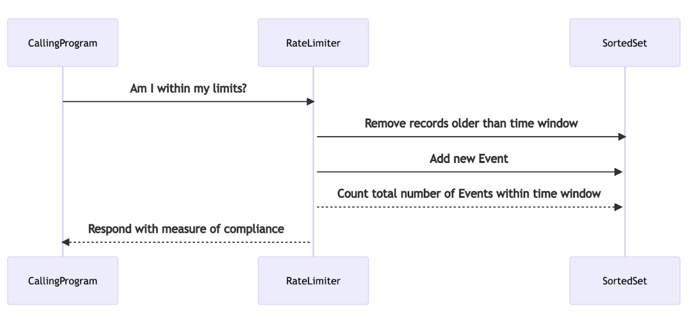

# LUA_rateLimiting
2021-11-07 

An example of 'sliding window rate limiting' using LUA scripting.

Other examples of rate limiting patterns exist:
* https://github.com/redislabsdemo/RateLimiter/tree/master/src/com/redislabs/metering/ratelimiter
* https://medium.com/swlh/rate-limiting-fdf15bfe84ab
* https://github.com/maguec/RateLimitingExample/tree/sliding_window
* https://redis.com/redis-best-practices/basic-rate-limiting/

This article is a well-written overview of Rate limiting patterns:
* https://medium.com/swlh/rate-limiting-fdf15bfe84ab


The purpose of the solution is to keep track of how many invocations are made: both against a shared resource in total, as well as for every individual consumer of that resource.  

By keeping track we can also enforce a limiting behavior - call this script before you invoke the actual underlying resource and if you get a positive response go ahead and invoke the actual resource.  If you get a negative response indicating that either the reource is over the limit, or the consumer is over its limit, then you must wait a bit before trying again. 

The Pattern is this:

    Store events in a SortedSet at whatever fidelity is needed:
    Per Account / region
    Per Minute / hour
    Each event has a score equal to the time as known by Redis
    Each time a new event occurs:
    Remove the events that are beyond the measured time window
    Add the new event
    Count the total number of events within the measured time window



This script uses SortedSets that store timestamps of each invocation made.
The SortedSet is a collection of entries with 2 values for each entry:
1) the score of the entry
2) the value of the entry

In our example, the SortedSets get populated with the timestamp up to the most recent second as the score and the value of the microseconds that have passed since the most recent second as the value. (this value is used to ensure that there are very few collisions within a single key - as SortedSets will not allow multiple entries with the same value)

Here is the result of calling ZRANGE on a key that holds entries for a shared resource with an id of 12:

```
127.0.0.1:6379> ZRANGE z:rl:resource:12{12} 0 -1 withscores
1) "104768"
2) "1636330091"
3) "111348"
4) "1636330093"
5) "129134"
6) "1636330097"
```

The script acts in this way:

When invoked, it deletes all records from the shared resource key that are older than the desired time window.  (In our example below, it delete all records older than 10 seconds before the moment of invocation).
  
The script next checks the number of remaining items stored in the SortedSet for the shared resource key and compares that number to the allowed number of invocations for that resource for the desired time-window.  
If the number is too large, the shared resource is over the limit and a negative message is returned to the caller.   
If the number for the shared resource is not too large, the script then deletes all records from the individual consumer key that are older than the desired time window.
The script then checks the number of remaining items stored in the SortedSet for the individual consumer (of the resource) key and compares that number to the allowed number of invocations for that consumer for the desired time-window.  
If the number is too large, the consumer is over its limit and a negative message is returned to the caller.   

If neither the resource nor the consumer are over the limit for the time window, both keys get an entry written to them that captures the moment of invocation so that future queries will count them against the next time window.  This is a positive outcome for the caller who should then proceed to invoke the actual desired resource as no limits have been reached by that caller.


The script follows:

```
SCRIPT LOAD "local rlimit = 0+ARGV[2] local climit = 0+ARGV[3] local t = (redis.call('TIME'))[1] local t2 = (redis.call('TIME'))[2] redis.call('ZREMRANGEBYSCORE',KEYS[1],'0',(t-ARGV[1])) local rcount = (redis.call('ZCARD',KEYS[1])) if (rcount == rlimit) then return 'RESOURCE OVERLIMIT: '..redis.call('ZCARD',KEYS[1]) elseif (((redis.call('ZREMRANGEBYSCORE',KEYS[2],'0',(t-ARGV[1]))) < 1000000) and (redis.call('ZCARD',KEYS[2]) < climit)) then return 'Adding '..(redis.call('ZADD',KEYS[2],t,t2))..' point to your count and '..(redis.call('ZADD',KEYS[1],t,t2))..' point to the resource count' else return KEYS[2]..' CONSUMER OVERLIMIT: '..redis.call('ZCARD',KEYS[2]) end"
```

You can load it into redis and receive a SHA unique id that can be later used to invoke it without passing the entire script every time:

```
SCRIPT LOAD "local rlimit = 0+ARGV[2] local climit = 0+ARGV[3] local t = (redis.call('TIME'))[1] local t2 = (redis.call('TIME'))[2] redis.call('ZREMRANGEBYSCORE',KEYS[1],'0',(t-ARGV[1])) local rcount = (redis.call('ZCARD',KEYS[1])) if (rcount == rlimit) then return 'RESOURCE OVERLIMIT: '..redis.call('ZCARD',KEYS[1]) elseif (((redis.call('ZREMRANGEBYSCORE',KEYS[2],'0',(t-ARGV[1]))) < 1000000) and (redis.call('ZCARD',KEYS[2]) < climit)) then return 'Adding '..(redis.call('ZADD',KEYS[2],t,t2))..' point to your count and '..(redis.call('ZADD',KEYS[1],t,t2))..' point to the resource count' else return KEYS[2]..' CONSUMER OVERLIMIT: '..redis.call('ZCARD',KEYS[2]) end"
```

This will return a hash like this:

```
"6efc874244ac8797c2b893fdafcd95c25a480003"
```

Which can then be used with the EVALSHA command along with necessary arguments which are:
### number of redis KEYS that will be passed in ( a neccessary part of using Lua with redis )
### KEYS[1] == shared resource key
### KEYS[2] == consumer for resource key
### ARGV[1] == time window to govern measured in seconds
### ARGV[2] == size of allowed operations count for shared resource key 
### ARGV[3] == size of allowed operations count for consumer for resource key

* in the following example the resource '12' has a limit of 5 invocations every 10 seconds, while the individual consumer '1' has a limit of 3 operations every 10 seconds. 

```
EVALSHA 6efc874244ac8797c2b893fdafcd95c25a480003 2 z:rl:resource:12{12} z:rl:resource:12{12}:consumer:1 10 5 3
```

Which results in output like this:

```
"Adding 1 point to your count and 1 point to the resource count"
```

If you run the command many times you will hit the limit for that consumer and get a response:

```
"z:rl:tw:1sec:resource:12:consumer:1 CONSUMER OVERLIMIT: 3"
```

If you run a few instances of the command where each one uses a different consumer key, they will, as a group hit the limit for the resource they share and get a response like this:

```
"RESOURCE OVERLIMIT: 5"
```

An easy way to demonstrate these behaviors is to use the redis-cli with the -i (for interval) argument.
Start the first redis-cli with a 1 second interval:

```
redis-cli -i 1
```

Then at the prompt issue the call to the script using the first consumer id:  [note that I also use a number before the call to ask redis-cli to repeat the command 100 times]

```
100 EVALSHA 6efc874244ac8797c2b893fdafcd95c25a480003 2 z:rl:resource:12{12} z:rl:resource:12:{12}consumer:1 10 5 3
```

In a separate shell, start the second redis-cli instance with a 2 second interval:

```
redis-cli -i 2
```

Then at the prompt issue a call to the script using a different consumer id: (this is done by changing the name of the second key passed in) 

```
100 EVALSHA 6efc874244ac8797c2b893fdafcd95c25a480003 2 z:rl:resource:12{12} z:rl:resource:12{12}:consumer:2 10 5 3
```


With a resource limit of 5 operations every 10 seconds, it is easy to see how both the resource limitation gets triggered, as well as the consumer limitations.

Output from the first redis-cli session looks like this once the second session gets going:

```
"Adding 1 point to your count and 1 point to the resource count"
"Adding 1 point to your count and 1 point to the resource count"
"Adding 1 point to your count and 1 point to the resource count"
"RESOURCE OVERLIMIT: 5"
"z:rl:tw:1sec:resource:12{12}:consumer:1 CONSUMER OVERLIMIT: 3"
"RESOURCE OVERLIMIT: 5"
"z:rl:tw:1sec:resource:12{12}:consumer:1 CONSUMER OVERLIMIT: 3"
"RESOURCE OVERLIMIT: 5"
"RESOURCE OVERLIMIT: 5"
"RESOURCE OVERLIMIT: 5"
"Adding 1 point to your count and 1 point to the resource count"
"Adding 1 point to your count and 1 point to the resource count"
"Adding 1 point to your count and 1 point to the resource count"
"RESOURCE OVERLIMIT: 5"
"z:rl:tw:1sec:resource:12{12}:consumer:1 CONSUMER OVERLIMIT: 3"
"RESOURCE OVERLIMIT: 5"
"z:rl:tw:1sec:resource:12{12}:consumer:1 CONSUMER OVERLIMIT: 3"
"RESOURCE OVERLIMIT: 5"
"RESOURCE OVERLIMIT: 5"
"RESOURCE OVERLIMIT: 5"
```

Meanhwile, the slower second session with the 2 second interval between its invocations shows this kind of output:

```
"Adding 1 point to your count and 1 point to the resource count"
"Adding 1 point to your count and 1 point to the resource count"
"RESOURCE OVERLIMIT: 5"
"RESOURCE OVERLIMIT: 5"
"RESOURCE OVERLIMIT: 5"
"Adding 1 point to your count and 1 point to the resource count"
"Adding 1 point to your count and 1 point to the resource count"
"RESOURCE OVERLIMIT: 5"
"RESOURCE OVERLIMIT: 5"
"RESOURCE OVERLIMIT: 5"
```

Looking at the resulting cardinality of the involved SortedSets reveals this state at the end of the run:

```
127.0.0.1:6379> ZCARD z:rl:resource:12{12}
(integer) 5

127.0.0.1:6379> ZCARD z:rl:resource:12{12}:consumer:1
(integer) 3

127.0.0.1:6379> ZCARD z:rl:resource:12{12}:consumer:2
(integer) 3
```

### time it takes to execute the script on my laptop: 786 microseconds on the redis side (less than one millisecond)
```
127.0.0.1:6379> multi
OK
127.0.0.1:6379> time
QUEUED
127.0.0.1:6379> EVALSHA 6efc874244ac8797c2b893fdafcd95c25a480003 2 z:rl:tw:1sec:resource:12{12} z:rl:tw:1sec:resource:12{12}:consumer:3 10 5 3
QUEUED
127.0.0.1:6379> time
QUEUED
127.0.0.1:6379> exec
1) 1) "1636394034"
   2) "445309"
2) "Adding 1 point to your count and 1 point to the resource count"
3) 1) "1636394034"
   2) "446095"
```

## A version of the script that only returns True when it is OK to invoke the shared resource and False when it is not OK looks like this:
(note it would be simple to replace False with 0 and True with 1 if you prefer)

```
"local rlimit = 0+ARGV[2] local climit = 0+ARGV[3] local t = (redis.call('TIME'))[1] local t2 = (redis.call('TIME'))[2] redis.call('ZREMRANGEBYSCORE',KEYS[1],'0',(t-ARGV[1])) local rcount = (redis.call('ZCARD',KEYS[1])) if (rcount == rlimit) then return 'False' elseif (((redis.call('ZREMRANGEBYSCORE',KEYS[2],'0',(t-ARGV[1]))) < 1000000) and (redis.call('ZCARD',KEYS[2]) < climit)) then redis.call('ZADD',KEYS[1],t,t2) redis.call('ZADD',KEYS[2],t,t2) return 'True' else return 'False' end"
```

Here is an example run with a 1/second redis-cli:

```
127.0.0.1:6379> 25 EVALSHA d64787ff546895181f231ed3102003a9697a7704 2 z:rl:resource:12{12} z:rl:resource:12{12}:consumer:1 10 5 3
"True"
"True"
"False"
"True"
"False"
"False"
"False"
"False"
"False"
"False"
"True"
"True"
"False"
"True"
"False"
"False"
"False"
"False"
"False"
"False"
"True"
"True"
"False"
"True"
"False"
(25.16s)
```

And the same time-frame with a 2/second redis-cli:

```
127.0.0.1:6379> 10 EVALSHA d64787ff546895181f231ed3102003a9697a7704 2 z:rl:resource:12{12} z:rl:resource:12{12}:consumer:2 10 5 3
"True"
"True"
"False"
"False"
"False"
"True"
"True"
"False"
"False"
"False"
(20.06s)
```

And the resulting ZCARD data for the keys involved:

```
127.0.0.1:6379> zcard z:rl:resource:12{12}:consumer:2
(integer) 2
(1.00s)
127.0.0.1:6379> zcard z:rl:resource:12{12}:consumer:1
(integer) 3
(1.00s)
127.0.0.1:6379> zcard z:rl:resource:12{12}
(integer) 5
(1.00s)
```


### Time it takes when the result is negative and a response of 0 (changed from false example to reduce transport) is delivered: 191 microseconds. (note time measurements are to show a general idea of the cost - your mileage will vary). Good rule of thumb: rate limiting checks should take no more than 20% of the time of the operation(s) they are protecting.  (you may also have cost/contract related reasons to limit rates that would encourage constant limiting regardless)  

```
127.0.0.1:6379> multi
OK
127.0.0.1:6379> time
QUEUED
127.0.0.1:6379> EVALSHA a4fadd8a0971fa009896b0c7a71b8fe7c929353a 2 z:rl:tw:1sec:resource:12{12} z:rl:tw:1sec:resource:12{12}:consumer:3 10 5 3
QUEUED
127.0.0.1:6379> time
QUEUED
127.0.0.1:6379> exec
1) 1) "1636395394"
   2) "656738"
2) "0"
3) 1) "1636395394"
   2) "656929"
```


## A note on the use of {12} <-- curly braces in the keynames

The content stored between the curly braces is used by redis as a routing value.  If the resource and the consumer share the same routing value: they can be processed in the same LUA script.  If they do not share the same routing value - a cross-slot error will occur.  For this reason it is helpful to provide a common and explicit value within a set of curly braces for the keys passed to our script.  

Because the SortedSets are always being trimmed so that only the entries within the last desired time window are kept, this implementation should enable millions of consumers to be represented along with their resource as SortedSets stored within the same Shard.  By adjusting the routing value for both the resource key and the consumer keys, it is even possible to guide certain groupings of resources and their consumers away from each other.

If I had a different resource to be protected with its consumers being limited, I could put its id inside the routing value instead. 

```
127.0.0.1:6379> 10 EVALSHA d64787ff546895181f231ed3102003a9697a7704 2 z:rl:resource:myduck{myduck} z:rl:resource:myduck{myduck}:consumer:2 10 5 3
```

As the routing is based on doing a modulus operator against the 16384 available slots and then routing the keys to the assigned partitions within your cluster that holds the resulting slot value - it should become obvious that you can have an influence on the distribution of your keys.  

Check out this for more strategies and detail: https://redis.com/blog/redis-clustering-best-practices-with-keys/   
